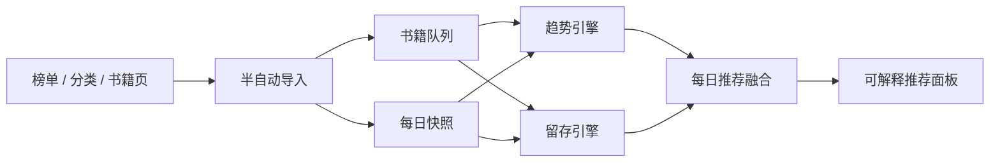

# 小说趋势信号台

一个面向网文作品的趋势追踪与可解释推荐系统。它不把“今天排第几”当成最终答案，而是把月票、推荐票、评分、评论、更新节奏和长篇衰减放进同一条时间线上，判断一本书到底是在短期冲榜，还是已经形成稳定口碑和读者留存。

> 当前版本是本地全栈应用：PowerShell 后端 + 原生 HTML/CSS/JS 前端。无需 Node、Python、数据库或构建工具，打开即可跑。

## 项目痛点

网文推荐最容易被三个假象带偏：

- **热度假象**：单日月票高，不一定代表趋势健康。
- **口碑假象**：裸评分高，不一定代表样本足够可信。
- **长篇假象**：完本或 200 万字以上作品不再冲榜，不等于读者已经流失。

这个项目把推荐拆成两个问题：

- 最近谁正在变热？
- 谁能在长篇或完本阶段继续留住读者？

系统最后给出的不是单一榜单，而是三张榜：

- **每日推荐**：融合近期趋势与长期留存。
- **近期活跃**：识别正在起势的作品。
- **长篇留存**：识别完本/超长篇的长尾生命力。

## 系统链路



## 评分核心

### 近期活跃引擎

用于判断作品在近 7 天到 90 天内是否正在吸引读者。

| 维度 | 权重 | 含义 |
| --- | ---: | --- |
| 月票动能 | 30% | 强时间窗口信号，适合捕捉近期爆发 |
| 推荐增长 | 22% | 累计互动的增量，不直接看总量 |
| 章节讨论 | 20% | 评论增量 + 新增章节评论密度 |
| 评分脉冲 | 16% | 贝叶斯评分 + 近 30 天评分变化 |
| 更新稳定 | 12% | 近 7 日更新字数反映追更连续性 |

### 长篇留存引擎

用于判断完本或 200 万字以上作品的长尾阅读价值。

| 维度 | 权重 | 含义 |
| --- | ---: | --- |
| 贝叶斯评分 | 30% | 用评分人数校准裸评分，降低小样本误判 |
| 留存指数 | 20% | 近期互动日均与历史日均比较 |
| 评论密度 | 18% | 章节评论数 / 章节数 |
| 推荐密度 | 17% | 推荐票 / 百万字数 |
| 评分稳定 | 15% | 近 90 天评分波动越小越好 |

### 衰减指数

衰减指数不是简单看“最近还有多少票”，而是比较近期互动与历史基线：

```text
retentionIndex = recentDailyInteraction / historicalDailyInteraction
decayIndex = 1 - normalized(retentionIndex)
```

指数越低，说明作品进入长篇或完本阶段后，读者讨论、评分、推荐仍能维持。

## 数据口径

系统会区分指标的时间属性：

- 月票更适合作为近期窗口信号。检测到月度重置时，按当期新增处理。
- 推荐票按累计互动处理。若快照出现回退，系统不会崩溃，而是降低该段可信度。
- 评分不直接使用裸分，而是引入评分人数做贝叶斯收缩。
- 章节评论数用于判断讨论深度，尤其适合长篇和完本作品。

## 半自动追踪

项目没有绕过站点风控，也不会自动读取你的浏览器 Cookie。真实数据接入采用半自动方式：

1. 用户在已登录浏览器中打开榜单、分类页或书籍页。
2. 将页面源码、保存后的 HTML，或页面可见文本粘贴到系统。
3. 后端解析公开元数据，识别 `bookId`、字数、评分、月票、推荐票等字段。
4. 写入本地快照，下一次排名自动使用新数据。

如果页面只有书籍链接但没有可解析指标，系统会先把作品加入追踪队列，不写入评分快照。

## 项目结构

```text
.
├── backend/
│   ├── NovelScoring.psm1      # 双引擎评分模型
│   └── server.ps1             # 本地 HTTP API 与静态资源服务
├── frontend/
│   ├── index.html             # 趋势工作台
│   ├── app.js                 # 榜单渲染、导入交互、详情面板
│   └── styles.css             # 分析台视觉系统
├── data/
│   ├── books.json             # 示例书籍队列
│   ├── snapshots.json         # 示例时间序列快照
│   ├── settings.json
│   └── targets.json           # 半自动追踪目标
├── scripts/
│   ├── daily-refresh.ps1
│   ├── register-daily-task.ps1
│   └── collect-qidian-probe.ps1
├── tests/
│   └── run.ps1
└── start.ps1
```

## 本地运行

```powershell
.\start.ps1 -Port 5177
```

打开：

```text
http://localhost:5177
```

测试：

```powershell
.\tests\run.ps1
```

## 接口概览

| Method | Path | 用途 |
| --- | --- | --- |
| GET | `/api/health` | 服务健康检查 |
| GET | `/api/books` | 书籍队列 |
| GET | `/api/targets` | 半自动追踪目标 |
| GET | `/api/recommendations?mode=daily` | 每日推荐 |
| GET | `/api/recommendations?mode=active` | 近期活跃榜 |
| GET | `/api/recommendations?mode=retention` | 长篇留存榜 |
| GET | `/api/books/{id}/history` | 单本书快照历史 |
| POST | `/api/track/refresh` | 生成/导入当日快照 |
| POST | `/api/import/snapshots` | 导入结构化快照 |
| POST | `/api/import/qidian-html` | 从页面 HTML/文本解析公开元数据 |

## 项目亮点

这不是“榜单搬运器”，而是一个小型推荐实验室：

- 用时间序列看趋势，而不是只看静态排名。
- 用贝叶斯口碑校准评分，而不是被裸分误导。
- 用衰减指数评价长篇，而不是让完本作品天然吃亏。
- 用半自动采集规避凭证依赖，保留真实数据接入能力。
- 用可解释面板展示每本书为什么被推荐。

## 采集边界

本项目只处理公开元数据，不采集付费章节正文，不自动读取用户 Cookie，不绕过验证码或访问控制。生产环境建议使用授权数据源、低频采集和审计日志。
